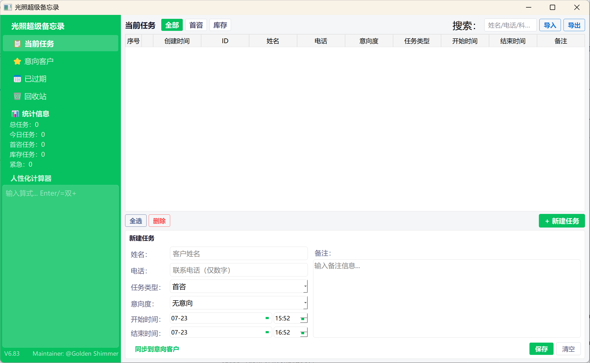



# 🌟 光照超级备忘录

*一款轻量、高效的桌面任务管理与CRM工具*

## 简介 / Introduction

光照超级备忘录是一款基于 PyQt5 开发的 Windows 桌面应用，集任务管理、客户意向追踪、CSV 导入导出、智能提醒于一体。界面采用绿色 Material Design 风格，简洁直观，专为需要高效管理客户跟进与日程安排的用户设计。

**Guangzhao Super Memo** is a PyQt5-based desktop application for Windows that combines task management, customer intention tracking, CSV import/export, and smart reminders in one tool. With a clean green Material Design interface, it's built for anyone who needs to efficiently manage customer follow-ups and daily scheduling.

## ✨ 核心功能 / Features

### 任务管理 / Task Management
- 📋 按类别管理任务：**首咨**、**库存**、二次截杀、多次截杀、已付定金
- 🔀 当前任务、已过期、回收站三视图切换
- 🏷️ 支持按类别筛选（首咨/库存）
- ✅ 批量选择、删除、恢复操作

### 意向客户追踪 / Customer Intention Tracking
- 👤 独立意向客户管理模块
- 📊 四级意向标注：无意向、低意向、高意向、包来的
- 📝 客户来源记录

### 智能提醒 / Smart Reminders
- 🔔 任务开始前 5 分钟自动弹窗提醒
- 💡 Windows 任务栏闪烁 + 置顶弹窗
- ⏰ "5分钟后再次提醒" 功能
- 🔄 后台定时轮询，不遗漏任务

### 数据导入导出 / Data I/O
- 📤 CSV 任务数据导出（UTF-8 BOM，兼容 Excel）
- 📥 CSV 批量导入（支持 UTF-8 和 GBK 编码）
- 🔧 自动时间格式规范化

### 其他亮点 / More
- 🧮 **内置计算器**：支持加减乘除，实时计算
- 📊 **数据看板**：总任务、今日任务、首咨/库存任务、紧急任务一目了然
- 🔍 **全字段搜索**：按姓名、电话、科目、备注搜索
- 💾 **SQLite 本地存储**：数据安全，无需联网
- 🎨 **Material Design 绿色主题**：视觉舒适，操作流畅

## 🚀 快速开始 / Quick Start

### 直接下载 / Direct Download

Windows 用户可以直接下载并运行：[超级备忘录.exe](dist/超级备忘录.exe?raw=1)

### 环境要求 / Requirements

- Python 3.8+
- Windows 操作系统
- PyQt5 5.15+

### 安装运行 / Installation

1. 克隆仓库：

git clone https://github.com/Golden-Shimmer/super-memo.git
cd super-memo

2. 安装依赖：

pip install -r requirements.txt

3. 运行程序：

python main.py

首次运行会在程序目录自动创建 	ask_manager.db 数据库文件。

## 📁 项目结构 / Project Structure

super-memo/
├── main.py              # 主程序入口（单文件应用）
├── requirements.txt     # Python 依赖
├── LICENSE              # MIT 开源协议
├── .gitignore           # Git 忽略规则
├── README.md            # 项目文档
└── screenshots/         # 截图目录

## 🛠 技术栈 / Tech Stack

| 技术 | 用途 |
|------|------|
| **PyQt5** | GUI 框架，界面构建 |
| **SQLite3** | 本地数据存储 |
| **ctypes** | Windows API 调用（任务栏闪烁） |
| **csv** | 数据导入导出 |
| **QSS** | 界面样式表 |

## 📝 使用说明 / Usage

1. **新建任务**：点击右下角 "+ 新建任务" 按钮，填写客户信息后点击 "保存"
2. **查看任务**：左侧导航栏切换当前任务 / 意向客户 / 已过期 / 回收站
3. **搜索**：顶部搜索栏输入关键词，支持姓名、电话、科目、备注
4. **编辑**：点击表格中任意任务行，左侧表单自动加载可编辑
5. **删除/恢复**：勾选任务后点击对应按钮

### CSV 导入格式

序号, 客户姓名, 电话, 意向度, 开始时间, 结束时间, 任务类型, 状态, 备注
1, 张三, 13800138000, 高意向, 2026-07-22 10:00, 2026-07-22 11:00, 首咨, , 需跟进

## 🤝 贡献 / Contributing

欢迎提交 Issue 和 Pull Request！

1. Fork 本仓库
2. 创建特性分支 (git checkout -b feature/AmazingFeature)
3. 提交更改 (git commit -m 'Add some AmazingFeature')
4. 推送到分支 (git push origin feature/AmazingFeature)
5. 开启 Pull Request

## 📄 许可 / License

本项目基于 MIT 协议开源，详见 [LICENSE](LICENSE) 文件。

## ⭐ 支持项目 / Support

如果这个项目对你有帮助，请给一颗 Star ⭐ 鼓励一下！
